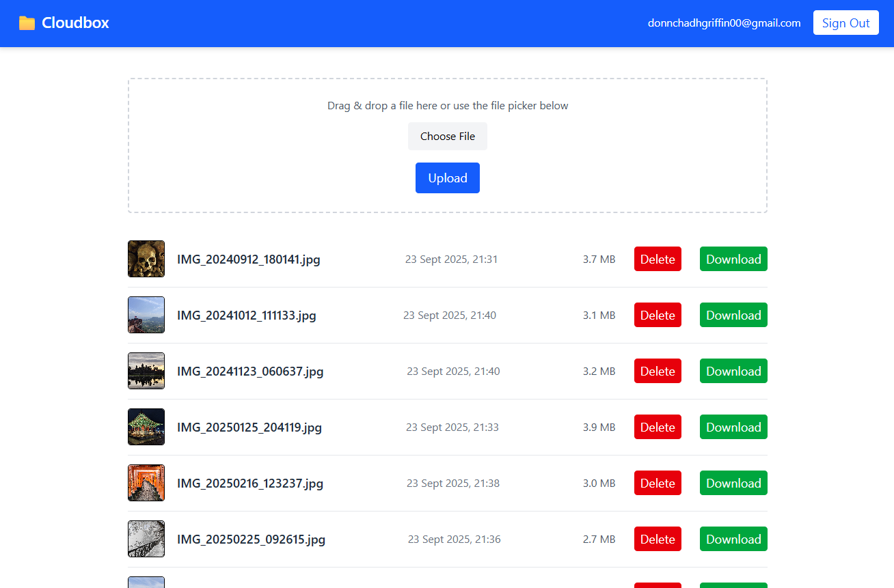

# CloudBox – Secure Serverless File Manager

CloudBox is a **Dropbox-style web application** that enables authenticated users to securely upload, preview, download, and delete files from cloud storage.

It features a modern drag-and-drop interface, built with **React** and **Tailwind CSS**, and uses **AWS serverless infrastructure** including **Cognito**, **Lambda**, **S3**, and **API Gateway**.

---

## Features

- User authentication via AWS Cognito
- Drag-and-drop file upload
- Image previews (JPG, PNG, etc.)
- Secure downloads via signed S3 URLs
- Delete files from user-scoped S3 paths
- Responsive UI with toast notifications and spinners
- Modular architecture using reusable components, hooks, and services

---

## Tech Stack

**Frontend**
- React + Vite
- Tailwind CSS
- react-hot-toast
- react-spinners

**Backend / Cloud**
- AWS Cognito (Auth)
- AWS S3 (Storage)
- AWS Lambda (Node.js)
- API Gateway (HTTP endpoints)
- AWS Amplify (CLI config & Auth hooks)

---

## Architecture Overview

- **Frontend**
  - Built with React + Vite
  - Uses AWS Amplify for frontend configuration and authentication (Auth module)
  - Communicates with API Gateway using JWT from Cognito

- **Authentication**
  - AWS Cognito User Pool manages user registration and sign-in
  - Cognito issues JWT tokens for authenticated requests

- **API Layer**
  - AWS API Gateway handles all client requests
  - Integrated with Cognito Authorizer to enforce access control
  - Forwards authorized requests to appropriate Lambda functions

- **Serverless Functions**
  - AWS Lambda functions handle core operations:
    - `upload`: upload files to S3
    - `list`: retrieve list of user files
    - `getFile`: return a signed URL for download
    - `delete`: remove user files from S3

- **Storage**
  - Amazon S3 is used for file storage
  - Files are stored in the format: `userId/filename`
  - IAM policies and S3 key prefixes restrict access per user

---

## Project Structure

```plaintext
cloudbox/
├── cloudboxapp/
│   └── src/
│       ├── App.jsx
│       ├── main.jsx
│       ├── amplifyconfiguration.json
│       ├── aws-exports.js
│       ├── components/        # UI components (TopBar, etc.)
│       ├── features/          # FileManager logic
│       ├── layout/            # Layout wrappers (e.g., MainLayout)
│       ├── services/          # AWS S3 + API functions
│       └── utils/             # Helper functions
├── lambda-function/           # AWS Lambda functions
│   ├── upload/
│   ├── delete/
│   ├── list/
│   └── getFile/
└── README.md
```

---

## Getting Started

### 1. Clone the Repository

```bash
git clone https://github.com/donnchadh00/cloudbox.git
cd cloudbox/cloudboxapp
```

### 2. Install Frontend Dependencies

```bash
npm install
npm run dev
```

### 3. Set Up AWS Amplify

Either run:

```bash
amplify init
amplify add auth
amplify add storage
amplify push
```

Or use your pre-configured `aws-exports.js` file.

---

## API Endpoints

| Method | Endpoint             | Description                 |
|--------|----------------------|-----------------------------|
| GET    | `/files`             | List all user files         |
| POST   | `/files`             | Upload a new file           |
| GET    | `/files/{filename}`  | Get signed URL for download |
| DELETE | `/files/{filename}`  | Delete a file               |

> All routes require a valid Cognito JWT in the `Authorization` header.

---

## Example UI



---